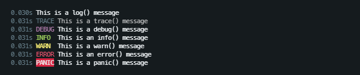
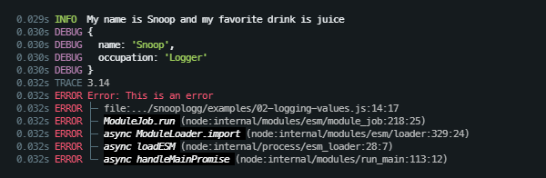
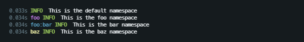
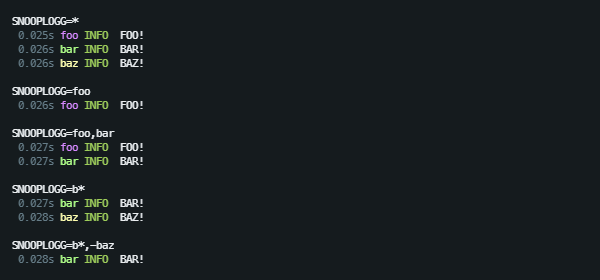
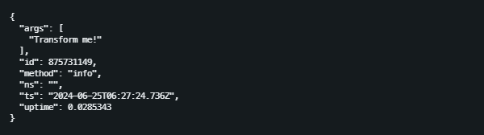

<br>
<div align="center">
	
</div>
<br>

SnoopLogg is a lightweight, zero dependency debug logging library for Node.js
and Bun. It is specifically designed for CLI programs, daemons, and libraries.

SnoopLogg is flexible and capable, but not the best solution for things such as
logging HTTP server requests, filtering by log level, and web browser console
is not supported. For CLI apps and libaries, SnoopLogg is the shiz.

# Features

 - Snoop on other SnoopLogg instances to aggregate log messages
 - Pipe log messages to one or more streams (such as a file or socket)
 - Namespaced and nested namespaced loggers with filtering support
 - Automatic namespace colorization
 - Custom log message formatting and styling
 - Pretty stack trace rendering
 - Support for object mode streams
 - Zero dependencies

# Basic Logging

SnoopLogg provides 7 loggers. `log()` is the only one that doesn't print a
label.

```javascript
import { log, trace, debug, info, warn, error, panic } from 'snooplogg';

log('This is a log() message');
trace('This is a trace() message');
debug('This is a debug() message');
info('This is a info() message');
warn('This is a warn() message');
error('This is a error() message');
panic('This is a panic() message');
```



By default, it prints the time from which the program has started, the log
method, and the log message. The format is completely customizable.

# Logging Values

SnoopLogg uses the built-in `util.format()` and `util.inspect()` to render
values.

```javascript
info('My name is %s and my favorite drink is %s', 'Snoop', 'juice');

debug({
  name: 'Snoop',
  occupation: 'Logger'
});

error(new Error('This is an error'));
```



# Namespaces

The default export is a `snooplogg` instance that can be invoked as a function
to create a namespaced child logger. You can have as many deeply nested
namespaces as you'd like.

```javascript
import snooplogg from 'snooplogg';

snooplogg.info('This is the default namespace');

const fooLogger = snooplogg('foo');
fooLogger.info('This is the foo namespace');

const barLogger = fooLogger('bar');
barLogger.info('This is the bar namespace');

const bazLogger = snooplogg('baz');
bazLogger.info('This is the baz namespace');
```



# Namespace Filtering

By default, debug logging is suppressed. You must enable it by setting the
`SNOOPLOGG` (or `DEBUG`) environment variable to the desired filter pattern.

```bash
$ SNOOPLOGG=* node myscript.js
```

Specifying `*` will display all log messages. The root log methods cannot be
filtered, only enabled or disabled.

Multiple namespace filters can be specified as a comma separated list.
Wildcards are supported. Prefix the filter with `-` (dash) to ignore the
pattern.

```javascript
const fooLogger = snooplogg('foo');
fooLogger.info('FOO!');

const barLogger = snooplogg('bar');
barLogger.info('BAR!');

const bazLogger = snooplogg('baz');
bazLogger.info('BAZ!');
```



Note that SnoopLogg does not support "log levels". If you want to filter by
log method, then you'll need to pipe SnoopLogg into an object mode
[transform stream](
  https://nodejs.org/api/stream.html#implementing-a-transform-stream
) that suppresses unwanted log messages, then pipe that into `stderr`, file,
etc. See `pipe()` below.

# Snooping

SnoopLogg allows you to "snoop" or aggregrate log messages from other
SnoopLogg instances.

For example, say you have an app and a library. The app writes all debug logs
to disk. You wouldn't necessarily want the library writing debug logs to disk,
so you can have the app debug logger "snoop" on the library's debug logger.

```
const app = new SnoopLogg().enable('*').pipe(process.stdout);
const lib = new SnoopLogg();

app('app').info('This is the app logger and it will snoop on all other loggers');
lib('lib').info('This is the lib logger, but nothing will be logged');
app.snoop();
lib('lib').info(`This is the lib logger and I\'m being snooped`);
```


You can stop snooping by calling `snooplogg.unsnoop()`.

# Programmatic Instantiation

You can create your own SnoopLogg instances instead of using the default one:

```javascript
import { SnoopLogg } from 'snooplogg';

const myLogger = new SnoopLogg();
myLogger.enable('*');
myLogger.info('Yippee yo!');

const fooLogger = myLogger('foo');
fooLogger.log('Yippee yay!');
```

Should you need to, you can also check to see if a specific namespace is
enabled by calling:

```
myLogger.isEnabled('foo');
```

# Piping

You can pipe SnoopLogg into one or more writable streams such as a file.

```javascript
const out = fs.createWriteStream('debug.log');
snooplogg.pipe(out);
snooplogg.info('This will be written to stderr and a file');
```

`pipe()` also accepts a second argument containing the stream specific
overrides:

```typescript
interface StreamOptions {
  colors?: boolean;
  elements?: LogElements;
  flush?: boolean;
  format?: LogFormatter;
}
```

If the history feature is enabled, then you can set the `flush` option to write
all messages in the history to the new pipe:

```javascript
snooplogg.pipe(out, { flush: true });
```

To stop piping to a stream:

```javascript
snooplogg.unpipe(out);
```

You can pipe the messages to a transform stream to have complete control over
each log message:

```javascript
import { Transform } from 'node:stream';

class MyTransformer extends Transform {
  constructor(opts = {}) {
    opts.objectMode = true;
    super(opts);
  }

  _transform(msg, enc, cb) {
    if (msg && typeof msg === 'object' && !(msg instanceof Buffer)) {
      this.push(JSON.stringify(msg, null, 2));
    }
    cb();
  }
}

const out = new MyTransformer();
out.pipe(process.stdout);

const myLogger = new SnoopLogg().enable('*');
myLogger.pipe(out);
myLogger.info('Transform me!')
```



You can pipe the debug log to as many streams as you like, however each log
message is formatted per stream. This could impact performance if you have a
lot of log messages and several streams. Instead, consider piping SnoopLogg to
a transform stream that in turn pipes to several streams:

```javascript
import { Transform } from 'node:stream';

class Demuxer extends Transform {
  _transform(msg, enc, cb) {
    this.push(msg);
    cb();
  }
}

const demuxer = new Demuxer();
demuxer.pipe(process.stdout);
demuxer.pipe(myfile);

myLogger.pipe(demuxer);
```

# History

SnoopLogg can buffer the previous log messages. By default, this is disabled.
To enable it, set the history size to the desired value:

```javascript
snooplogg.config({ historySize: 5 });
```

The code above will buffer the last 5 messages. To dump the history, you need
to pipe SnoopLogg to a writable stream and set the `flush: true` flag.

```javascript
for (let i = 1; i <= 10; i++) {
	snooplogg.info(`This is message ${i}`);
}

snooplogg.pipe(process.stdout, { flush: true });

```


This feature is specifically designed for daemons (e.g. servers) and takes
inspiration from `adb logcat`.

For example, pretend you have a server running in the background. Now you want
to see the debug log for when the server is initializes, but by the time you
connect, those messages are in the past. Don't stress. Simply set the
`historySize` to something reasonable, then implement a "logcat" route handler
that pipes the SnoopLogg instance to the connection socket with `flush: true`
set. SnoopLogg will automatically unpipe the stream when it is ended.

Note that setting a relative large history size may impact performance.

# Config

SnoopLogg has a relatively simple configuration:

```typescript
interface SnoopLoggConfig {
	colors?: boolean;
	elements?: LogElements;
	format?: LogFormatter | null;
	historySize?: number;
}
```

You can call the `.config()` function to change the default logger or pass the
config into a new instance.

```javascript
snooplogg.config({ historySize: 10 });
```

```javascript
const myLogger = new SnoopLogg({ historySize: 10 });
myLogger.config({ historySize: 20 });
```

We'll discuss these settings in more detail below.

## `colors`

Set this flag to `false` to to disable colors. Colors are enabled by default
unless overwritten by the stream settings or the stream is not a TTY.

## `elements`

You can pass in an object with overrides for any of the element specific
renderers.

```typescript
type FormatLogElements = {
	error: (err: Error, styles: StyleHelpers) => string;
	message: (msg: string, method: string, styles: StyleHelpers) => string;
	method: (name: string, styles: StyleHelpers) => string;
	namespace: (ns: string, styles: StyleHelpers) => string;
	timestamp: (ts: Date, styles: StyleHelpers) => string;
	uptime: (uptime: number, styles: StyleHelpers) => string;
};
```

Each element formatter is passed a `styles` object containing the contents of
the [ansi-styles](https://github.com/chalk/ansi-styles) package. It also
includes the `nsToRgb(string)` function which deterministically finds a color
based on the supplied string where the color is not too light or too dark.

```javascript
snooplogg.config({
  elements: {
    namespace(ns, { color, nsToRgb, rgbToAnsi256 }) {
      const { r, g, b } = nsToRgb(ns);
      return `${color.ansi256(
        rgbToAnsi256(r, g, b)
      )}${ns}${color.close}`;
    }
  }
});
```

## `format()`

A custom formatter that renders a log message.

```javascript
snooplogg.info('This is the default format');

snooplogg.config({
  format(msg, styles) {
    const { args, colors, elements, method, ns, ts, uptime } = msg;
    return `${ts.toISOString()} [${method}] ${args.join(' ')}`;
  }
});

snooplogg.info('This is the custom format');
```


## `historySize`

The number of log messages to buffer. Defaults to `0`. Pipe SnoopLogg to a
writable stream with `{ flush: true }` to see the buffered messages.

# Demo

Pull the repo, `pnpm i && pnpm build`, then run:

```bash
SNOOPLOGG=* node demo/demo.js

# or

SNOOPLOGG=* bun demo/demo.js
```

## License

MIT
